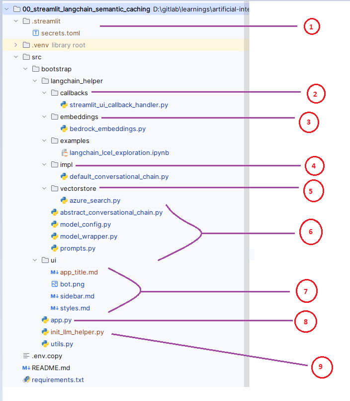
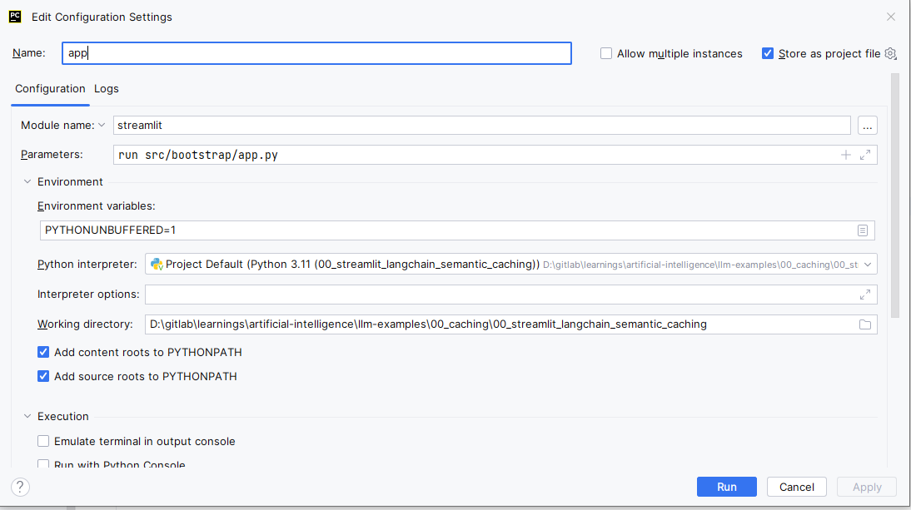
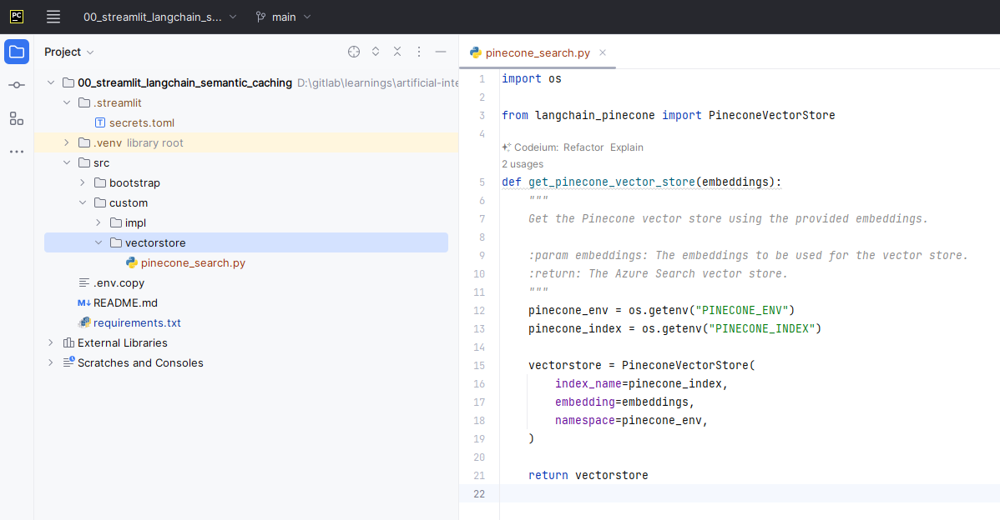
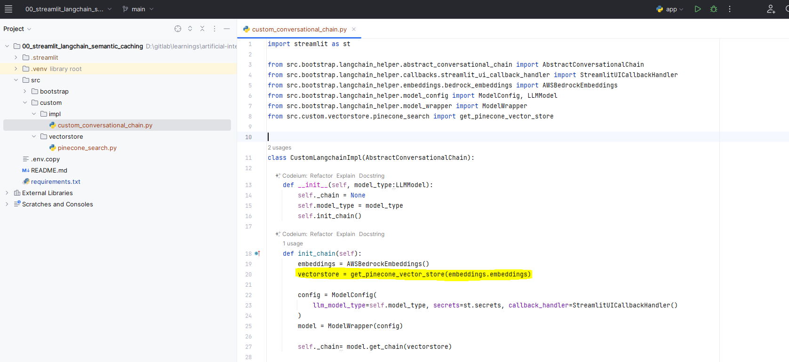
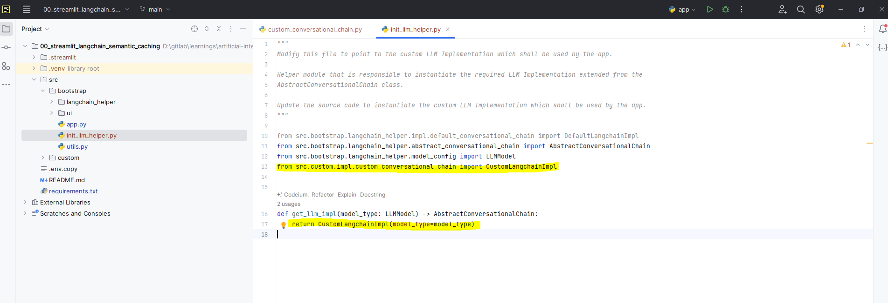

# LLM Examples

This repository encloses examples related to the exploration made regarding various aspects of LLMs.

## Exploring your own example from the bootstrap code.

To ease up the LLM exploration via Streamlit and langchain, we have created a bootstrap based setup that can be used as a starting point.

The bootstrap can be found in any of the examples src folder. For instance, refer to this [one](./00_caching/00_streamlit_langchain_semantic_caching/src/bootstrap/).

The folder structure is as follows:

1. `secrets.toml` file contains information such as credentials and other configuration related information. Refer to the `.env.copy` file for more details. `This file should not be committed to the version control. Add this to .gitignore to avoid the same`.
2. `callbacks` folder contains callback handler implementation that shall be leveraged by the LLM.
3. `embeddings` folder contains provider specific implementation. In the above example, we have used `Bedrock Embeddings` from `AWS`.
4. `impl` folder contains implementation of `abstract_conversational_chain.py` which shall be initialized during the chat bot construction.
5. `vectorstore` folder contains provider specific implementation. In the above example, we have used `Azure search` as the vectorstore. Note that the `embeddings` initialized in `Step 3` shall be used as an input for the vectorstore for retrieval purposes.
6. Base implementation that abstracts most of the boilerplate stuff while initializing the LLM.
7. `ui` folder contains configurable user interface related aspects.
8. `app.py` is the main entrypoint for the application. Do not modify this file unless required.
9. `init_llm_helper.py` provides an interface to the `app.py` to receive the implemented conversational chain instance.

### How do I use the bootstrap code?

Create your own directory and copy the bootstrap code to the `src` folder maintaining the above structure and run the application.

> Prefer to create virtual environment to explore the examples in an isolated environment.

Example run configuration from the Pycharm interface:

### How do I extend this for my use case ?

Below, you can find an example of utilizing a different vector store provider and custom LLM chain implementation.

Create a folder named `custom` beneath your `src` folder to hold the custom implementation.

For this demonstration, we have opted to use a different vector store provider. Created a sub-folder `vectorstore` under the `custom` folder with the implementation for the `Pinecone` vector store.

> Import necessary requirements that is required by your custom implementation.

Extended the `abstract_conversational_chain.py` with the custom implementation within the `impl` folder. It can be noted that the custom implementation is now using the `Pinecone` vector store.

Now, edit the `init_llm_helper.py` in the `bootstrap` folder to point to the custom version of the class.

Thats it, now the chatbot can respond to queries based on the retrived context from the vector store.

To keep it simple, always try to create dedicated implementation in your custom folder and edit `init_llm_helper.py` file to refer to the custom implementation.

Feel free to modify the bootstrap implementation if any of the implementations cannot be customized without altering the base.

## Examples

1. [Streamlit langchain semantic Caching](./00_caching/00_streamlit_langchain_semantic_caching/) - _Minimalistic example explaining the concept of semantic caching using langchain._

## Additional information

### How to debug a Streamlit application from Pycharm

## References

### RAG Related

[5 Levels of text splitting for efficient RAG - An interesting and informative blog with several citations](https://github.com/FullStackRetrieval-com/RetrievalTutorials/blob/a4570f3c4883eb9b835b0ee18990e62298f518ef/tutorials/LevelsOfTextSplitting/5_Levels_Of_Text_Splitting.ipynb) - [Local Copy](./04_advanced_rag/01_5_Levels_Of_Text_Splitting.ipynb) - [Chunk viewer Tool](https://chunkviz.up.railway.app/)
