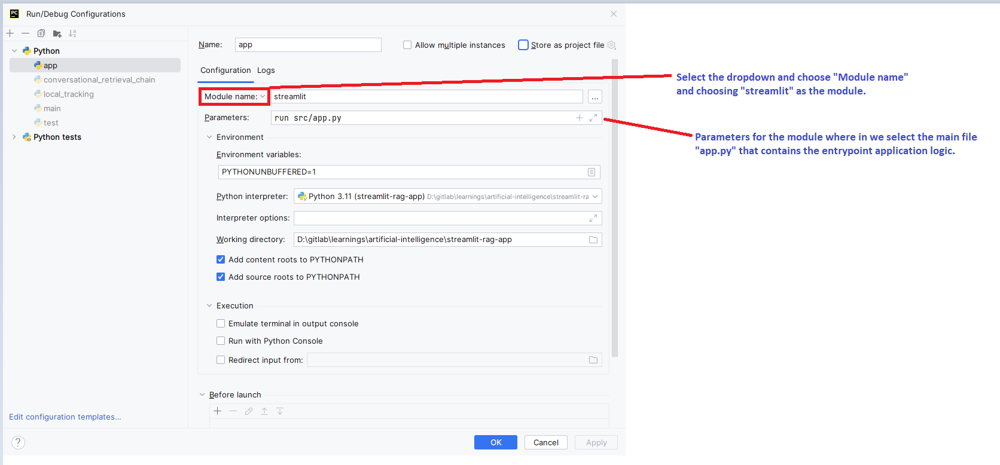

# LLM Examples

This repository encloses examples related to the exploration made regarding various aspects of LLMs.

## Examples

1. [Streamlit langchain semantic Caching](./00_streamlit_langchain_semantic_caching/) - _Minimalistic example explaining the concept of semantic caching using langchain._

## Additional information

### How to debug a Streamlit application from Pycharm

